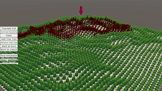

# fire-spreading

# preview
  

# full preview
https://youtu.be/VU6ZuYC45wU

Uses Graphics.DrawMeshInstancedIndirect to draw trees on terrain.
you can mark some trees to be burnt when the simulation active.

